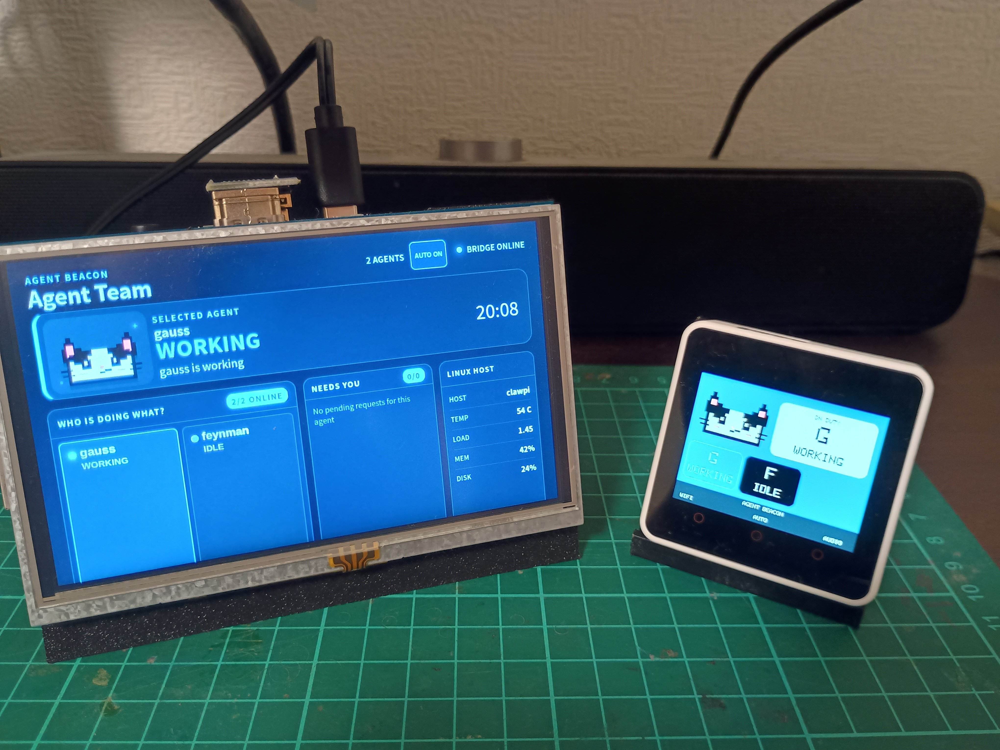
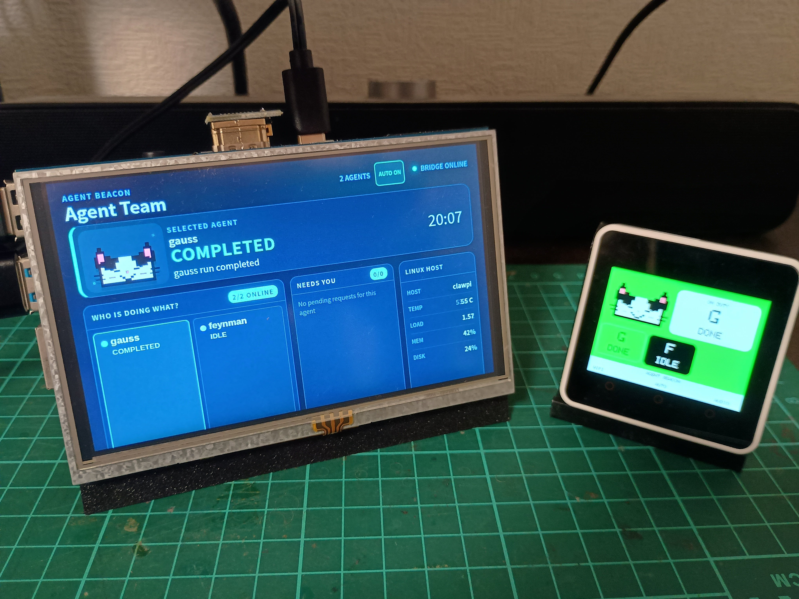
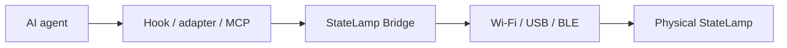

# StateLamp

StateLamp is a physical status display for AI agents. It lets you see at a glance when an agent is working, waiting for approval, needs human input, has completed, or has failed—even when you are away from the terminal.

It was originally built for and is actively used with OpenClaw. The Bridge itself uses an agent-agnostic API, so other agents can be connected through lightweight hooks or adapters.

StateLamp is an independent open-source project and is not affiliated with or endorsed by OpenClaw, OpenAI, or Anthropic.

日本語ドキュメント: [README.ja.md](README.ja.md)

## Demo

Two StateLamp endpoints working together: the Raspberry Pi team console on the left and an M5Stack Core2 status display on the right.

<p>
  
  
</p>

## Why StateLamp?

Long-running agents are useful precisely when their operator is doing something else. A terminal window is easy to miss when an agent stops for approval, needs a physical check, or finishes a run. StateLamp separates the agent's state from the screen and sends a small normalized status to an ambient device.

## How it works



The Bridge is a small in-memory FastAPI service. Agent-specific event handling belongs in an integration. A device can poll the Bridge over Wi-Fi, or a host can relay the status over USB or BLE.

StateLamp does not control agents or decide what they should do; it receives normalized state and attention events and displays them.

## Agent states

| State | Meaning |
|---|---|
| `idle` | Ready or inactive |
| `working` | Processing a run |
| `waiting_approval` | Waiting for an approval decision |
| `human_required` | Explicit human action, input, or judgement is required |
| `completed` | Run completed successfully |
| `error` | Run ended unsuccessfully |
| `offline` | Device-local state when its Bridge cannot be reached; the Bridge does not emit it |

Explicit human attention is tracked separately from normal status. Each request has an ID and a lifecycle: `pending`, `resolved`, `cancelled`, or `expired`. This prevents one agent or run from accidentally clearing another request.

## Quick start: Bridge and generic API

Python 3.10+ is recommended.

```bash
cd bridge
python3 -m venv .venv
. .venv/bin/activate
python -m pip install -r requirements.txt
uvicorn app.main:app --host 127.0.0.1 --port 8000
```

In another terminal:

```bash
curl http://127.0.0.1:8000/healthz
curl -X POST http://127.0.0.1:8000/api/v1/status \
  -H 'content-type: application/json' \
  -d '{"agent":"example-agent","state":"working","message":"Running tests"}'
curl http://127.0.0.1:8000/api/v1/status
```

The complete HTTP contract is in [docs/protocol.md](docs/protocol.md). The service is intentionally unauthenticated in the current version; keep it on a trusted network and do not expose it to the public internet. The Compose example binds to localhost by default. Set `STATELAMP_BIND_ADDRESS` explicitly when physical devices on a private LAN need to reach it.

## OpenClaw integration — reference implementation

`adapters/openclaw/` is the most complete integration and is the actively used reference implementation. It publishes:

- gateway start → `idle`
- LLM input / run start → `working`
- operator approval events → `waiting_approval`
- successful agent end → `completed`
- unsuccessful agent end → `error`
- explicit `human_required` tool calls → attention requests
- session/run cleanup → owner-scoped attention cancellation

The adapter preserves session and run ownership, supports exact attention-ID clearing, and treats notification failure as separate from the human action still being required. Installation and OpenClaw-version-specific details are documented in [adapters/openclaw/README.md](adapters/openclaw/README.md).

## Integrations

| Integration | Status | Scope |
|---|---|---|
| OpenClaw | Reference / actively used | Plugin, approval watcher, status and attention lifecycle |
| Generic HTTP API | Available | Publish normalized state or attention directly |
| Codex | Experimental | Local stdio MCP server for human calls; tested locally, not presented as a general Codex runtime integration |
| Claude Code | Planned | No maintained or verified adapter is currently included |

Adding another agent should normally require only a small hook or adapter:

```text
agent-specific event -> normalized HTTP request -> Bridge -> device
```

## Hardware

StateLamp currently includes:

- Raspberry Pi UI: Agent Team Console for multiple agents and attention requests
- original M5Stack Core2: display, notification audio, and local mute control
- ESP32-S3: StateLamp state LED firmware

The Raspberry Pi UI and M5Stack Core2 are the maintained device integrations. The ESP32-S3 target is a compact state-LED version of StateLamp and a starting point for further integration.

Setup instructions are provided in the device READMEs: [Raspberry Pi](hardware/raspberry-pi/README.md), [M5Stack Core2](hardware/m5stack-core2/README.md), and [ESP32-S3](hardware/esp32s3-blink/README.md).

## Core2 firmware

See [hardware/m5stack-core2/platformio.ini](hardware/m5stack-core2/platformio.ini) for the M5Stack Core2 PlatformIO environment. Copy [hardware/m5stack-core2/include/device_config.example.h](hardware/m5stack-core2/include/device_config.example.h) to the ignored `device_config.h`, then replace the example Wi-Fi values and Bridge URL.

## Project status and limitations

StateLamp is an individual open-source project under active development. The Bridge API and OpenClaw integration are the most mature parts of the project. Device firmware has hardware-specific assumptions, and Codex is experimental. The Bridge stores state in memory, has no authentication, and loses pending attention on restart; use it on a trusted local network until those constraints are acceptable for your environment.

## License

Original StateLamp code is provided under the MIT License. See [LICENSE](LICENSE). Dependency licenses remain those of the respective PlatformIO/npm packages.
